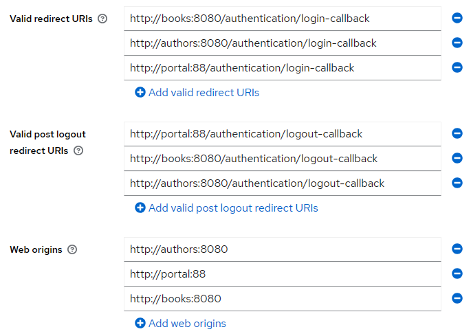
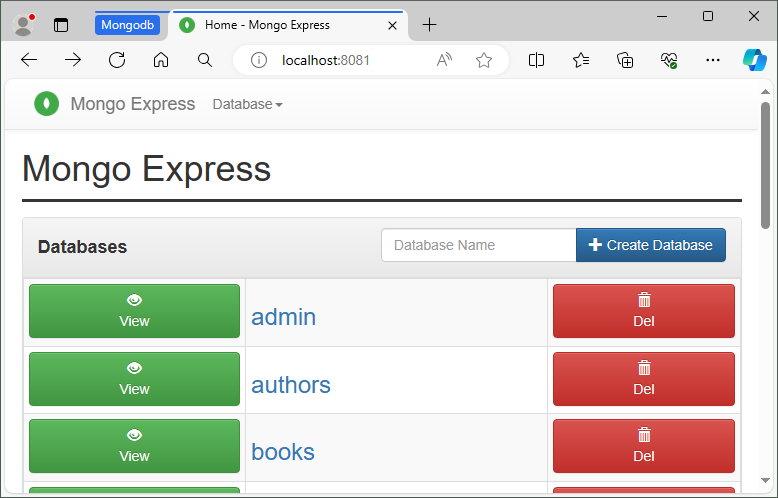
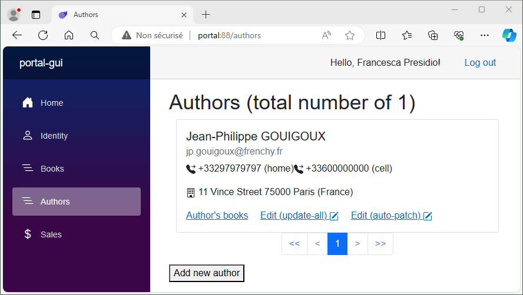

# DemoEditor sample information system

This is the sample application that comes with the book `Enterprise Architecture with .NET`, published by Packt. It is a system composed with several services that can be run together using Docker Compose. Some of the services are existing images, some are provided as custom, .NET-based, API-compatible, services.

## Context

**DemoEditor** is a sample company that is supposed to edit books. As such, it needs a data referential services for books, which is in `books-controller`, another one for authors, which is in `authors-controller`, and a portal application to exploit these data providers and add some business process. This application is a Blazor Web Assembly Single-Page Application, provided in the `portal-gui` folder. A mobile application based on MAUI is also provided for reference, but we will only show the installation of the web platform. The rest of the dependencies will be provided in the `docker-compose.yml` file.

## Caveat

The book is definitely not about programming. In fact, it is quite the contrary, as the method exposed in it insists on the importance of the right definition of services and API contracts, the respect of separation of responsibility and the use of norms and standards for interface, stating that those are more important than the code implementation itself. You will thus find lots of C# bits of code that are sub-optimal, or even quick-and-dirty versions of a method. **This is done on purpose**, both to stress the importance of the code structure rather than its execution details, and to give the readers opportunities to verify that adjusting implementations indeed does not impact the architecture in itself, owing to the right cutting of services, in alignment to the business functions.

This is of course not to say that I am against code improvements and I will be more than happy to receive any pull requests and possibly integrate them as examples of better implementations that are made easy by a solid initial architecture.

## Versioning

The sample application follows versions that hopefully make it easier to read the book chapters and associate them with different steps in the construction of the information system:
- Branch [v0.1](https://github.com/PacktPublishing/Enterprise-Architecture-with-.NET/tree/v0.1/DemoEditor) corresponds to a **very simple form of the application**, with only the two APIs working and a basic portal, both **without any authentication mechanism** in order to ease use as a demo of the data referential services and overall comprehension of the concepts.
- Branch [v0.2](https://github.com/PacktPublishing/Enterprise-Architecture-with-.NET/tree/v0.2/DemoEditor) adds the **authentication and authorization management** to the application (both frontend and backend) using a Keycloak IAM server. It also adds the batch import of data, using a Docker volume.
- Branch [v0.3](https://github.com/PacktPublishing/Enterprise-Architecture-with-.NET/tree/v0.3/DemoEditor) shows the implementation of a business process for the book creation. Rather than simply adding an entity, this process progressively enhances the structure of the book. This version also adds a webhook mechanism that updates the locally-duplicated attributes of the main author of a book when this author is modified.
- Branch [main](https://github.com/PacktPublishing/Enterprise-Architecture-with-.NET/tree/main/DemoEditor) is the most up-to-date version of the application, with **maximum content, including applications from all chapters** of the book (and thus highest level of complexity for a full installation).

## Prerequisites

Docker has been used in order to reduce as much as possible the required tooling. Since all images are available online (even the custom ones created for the sample information system, available at `https://hub.docker.com/repositories/demoeditor`), all you need to work with the application is Docker (see https://docs.docker.com/engine/install/ for installation instructions). The images versions follow the branches of the code.

If you want to debug the application, make some changes to it in order to follow the instructions from the book, then you will also need .NET 8.0 SDK (https://dotnet.microsoft.com/download), Visual Studio Code (https://code.visualstudio.com/download), and Git (https://git-scm.com/book/en/v2/Getting-Started-Installing-Git). Postman (https://www.postman.com/) will also be used as an option to quickly inject data.

## Installation

Even if everything is installed in the local machine, it makes it much easier to use aliases, so you will need to edit your `hosts` file (`/etc/hosts` for Linux, `C:\Windows\System32\drivers\etc\hosts` for Windows) and add the following lines:

```
127.0.0.1 iam
127.0.0.1 portal
127.0.0.1 authors
127.0.0.1 books
```

In order to avoid as much network conflicts as possible, the main application is exposed on port 88 instead of the default port 80. No HTTPS is used, again with the objective of simplifying as much as possible the deployment of the sample information system.

If you use the command line to retrieve the necessary files (you may also download the corresponding compressed package from the Github interface), you will need to use the following operations:

```
git clone https://github.com/PacktPublishing/Enterprise-Architecture-with-.NET
git checkout v0.3
```

Running the application is then as simple as launching Docker Compose on the right file:

```
cd DemoEditor
docker compose up -d
```

## Defining IAM

The Identity and Authorization Management server (Apache Keycloak, in our case) has been activated in the Docker Compose service for this version, and must be configured:
1. Connect to http://iam:8080/admin/master/console/, using the credentials defined in the `docker-compose.yml` file.
2. Create a realm called `demoeditor`.
3. Add 3 realm roles, named `editor`, `director` and `author`.
4. Create a client with `portal` as its id, and use default in the `Capability config` tab of the wizzard.
5. In the following step, add the login-callback, logout-callback and web origins for localhost, but also ports 81 and 82.

The content should be like follows (the ports are the one inside Docker Compose, not the exposed ones):



6. Click the `portal-dedicated` link in the `Client scopes` tab.
7. Add the predefined mapper called `realm roles`.
8. In this new mapper, activate the `Add to ID token` setting.
10. Add a `francesca` user.
11. Assign this account the `director` role.

Note that an export of the realm settings is provided in the `resources` folder, to speed up the process (to import, browse the file when in the `create realm` command; you will need to re-create the users, though). In a following version (which means another branch of this repository), we will also harden a bit the IAM, with an appended database to store setting in a persistant manner.

## Injecting some data

The files [DemoEditor.postman_collection.json](resources/DemoEditor.postman_collection.json) and [DemoEditor.postman_environment.json](resources/DemoEditor.postman_environment.json) can be imported into Postman to respectively create a collection of API calls and an environment, both called `DemoEditor`. You will find in the collection some operations to create sample data:


Using the `DemoEditor` is needed to point correctly to the API implementations:


The commands use the variables of the environment in order for you to quickly adapt to your own setting. I recommend you run at least the `Create author` and `Create book` operations:


Since we have activated authentication and authorization in this version, it is necessary to edit the `Authorization` parameters of the `DemoEditor` collection (all levels below inherit from it), and obtain an OAuth 2.0 token, with such a configuration to retrieve it from Keycloak (check the book for all details):


## Batch import of data

Sending data by hand is not very effective, so we will take advantage of the `import` volume declared in the Docker Compose file and use the following command to load the Excel workbook provided in the folder called `resources` (note that all commands are provided Linux-style; if you are using Windows, please operate them through WSL):

```
docker run --rm -v ./resources/DemoEditor-BooksCatalog.xlsx:/tmp/DemoEditor-BooksCatalog.xlsx -v demoeditor_import:/tmp/data ubuntu cp /tmp/DemoEditor-BooksCatalog.xlsx /tmp/data
```

Once this is done, you may use the following Postman operation to integrate the content from the Excel workbook:


A GUI to inspect content of the MongoDB database is also provided in this version, with credentials visible in the `docker-compose.yml` file to connect to such an interface:



## Running the application

Going to `http://portal:88` should provide the following interface (if an error occurs, check the 88 port is not already used in another process):


Most menus are invisible, until you click on `Log in` and connect using the `francesca` user that has been created above, and who have most accesses, owing to her `director` role:


Clicking on the `Books` menu brings you to the list of books in the dedicated service:


From there, you can reach the author's edition form:


It is also possible to access the authors from the dedicated list (`Authors` menu):



This interface allows you to edit authors with the auto-patch method (see the book for more information):


If you log out, create a user with a simple `editor` role, which provides fewer accesses (or even `author`, which has almost no rights), then log in again using this new user, you will notice some menus do not appear. In addition, trying to enter the URL directly will not help and you will be rejected anyway:


And that's about it for this second version of the sample application. The evolution to a secured system has been realized without touching any of the business function, but that sounds logical. The real test of the architecture will be when adding some business-related features, which will be the subjects of the following versions (see other branches of the repository).
